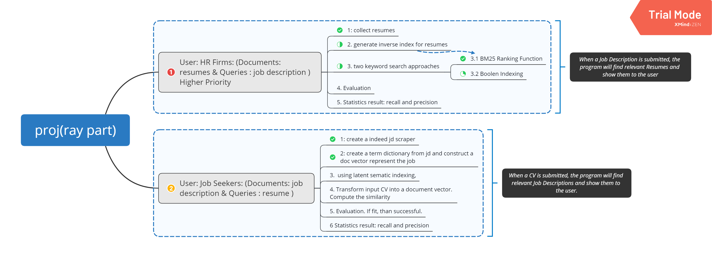

CSC575_PROJ
==============================

Section: Ruiyu

Project Progress
------------

Project Organization
------------

    ├── LICENSE
    ├── README.md         
    ├── data
    │   ├── document       <- resume rocuments.
    │   ├── index          <- inverted index and lengh index.
    │   ├── jd             <- indeed job description 
    │   └── raw           
    │
    ├── notebooks          <- Jupyter notebooks. Naming convention is a number (for ordering),
    │                         the creator's initials, and a short `-` delimited description, e.g.
    │                         `1.0-ir-initial-ranking-exploration`.
    │
    ├── references          
    │
    ├── src                <- py file.
    │   
    ├── requirements.txt   <- The requirements file for reproducing the analysis environment, e.g.
    │                         generated with `pip freeze > requirements.txt`

--------

